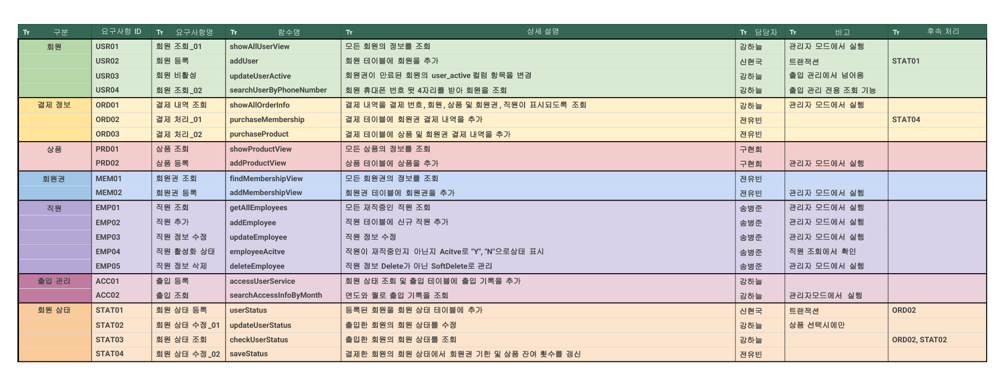
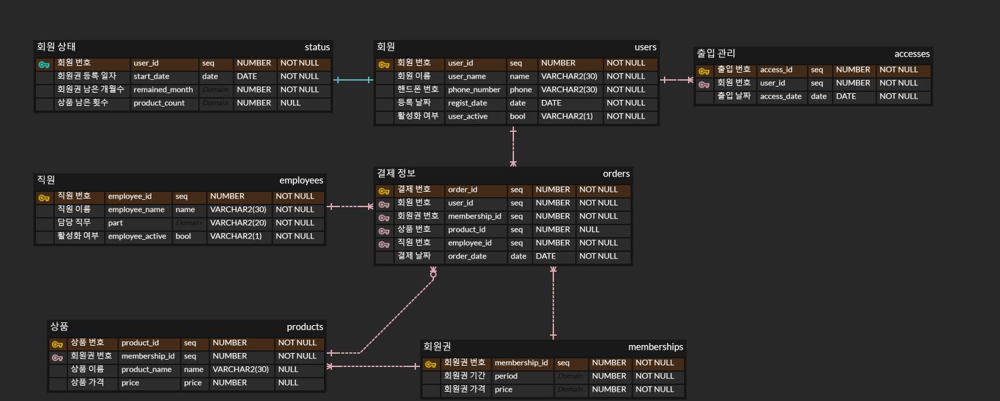
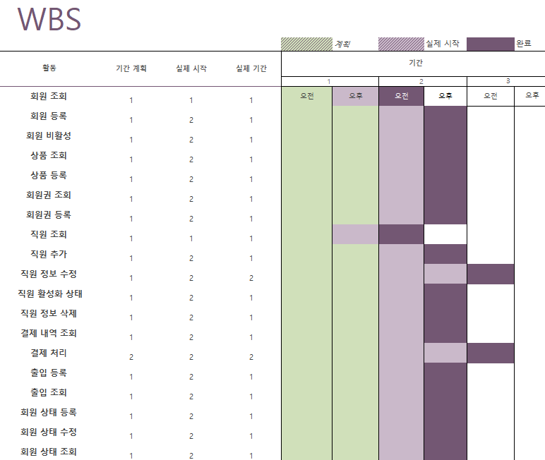
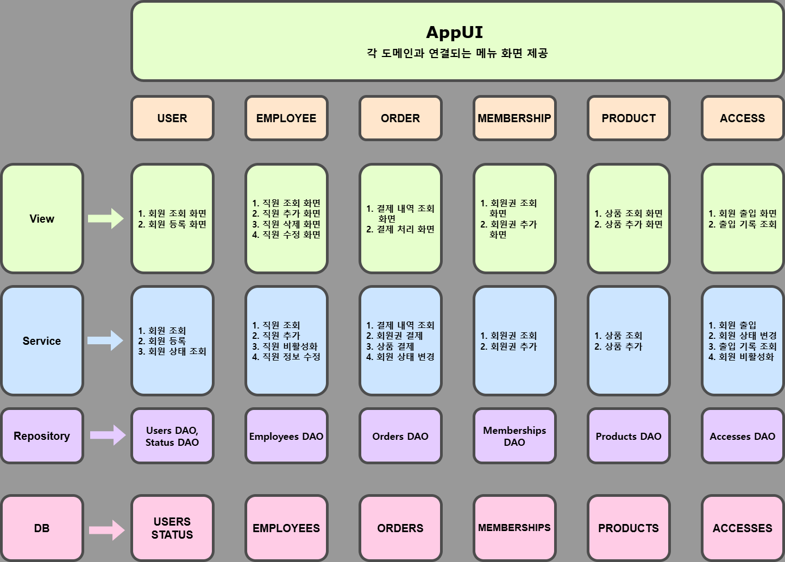
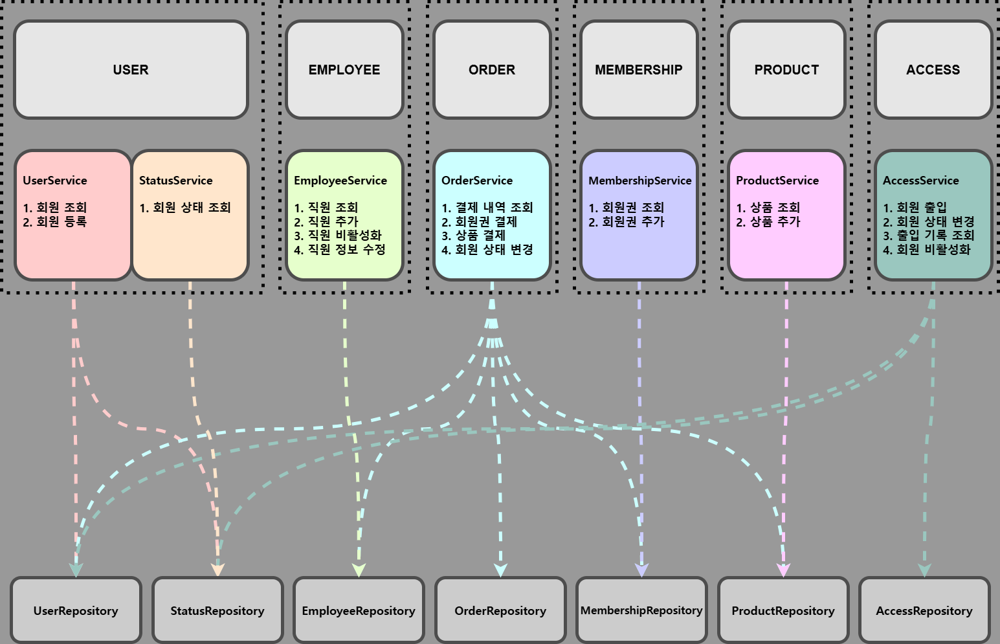

# 💻프로젝트 기획서

## 1. 개요

**_프로젝트명_**: gym_service

**_프로젝트 기간_**: 2025-03-24 ~ 2025-03-27

**_팀장:_** 강하늘 **_팀원:_** 전유빈, 신현국, 송병준, 구현희

## 2. 목적 및 배경

#### 주제 선정 이유

건강에 대한 관심이 높아짐에 따라 많은 사람들이 이용하는 시설인 헬스장의 관리 시스템을 개발하여,
실생활에 유용하게 적용할 수 있는 프로그램을 만들고자 하였습니다.

#### 목표

1. 효율적인 회원 관리 및 이용
2. 회원 데이터 관리 안전성과 보안 강화
3. Java, SQL, 협업 연습을 통한 발전

## 3. 개발 환경

- 프로그래밍 언어: Java
- 데이터베이스: Oracle database
- 개발 도구: Intellij
- 형성 관리 툴: GitHub

## 4. 주 개발 범위

- Java
  - 회원, 직원, 상품, 회원권, 출입관리 등 주요 기능 개발
  - 트랜잭션 처리 및 예외 관리
- DB
  - 회원 상태, 회원 및 직원 정보, 출입 기록, 결제 정보, 상품 및 회원권 저장
- 서비스 소개
  - 회원 및 직원 관리, 상품 및 회원권 운영, 출입 기록 관리를 처리할 수 있도록 설계한 서비스입니다. Oracle Database를 활용하여 데이터를 저장 및 관리하며, Java를 기반으로 개발하였습니다.

## 5. 주요 기능

#### 회원 & 직원

- **회원**: 회원 조회, 등록, 활성/비활성
- **직원**: 직원 조회, 추가, 수정, 활성/비활성, 삭제

#### 상품 & 회원권

- **상품**: 상품 조회, 등록
- **회원권**: 회원권 조회, 등록

#### 출입 관리 & 회원 상태

- **출입 관리**: 출입 조회, 등록
- **회원 상태**: 상태 조회, 등록, 수정

## 6. 요구사항 정의 및 ERD

[요구사항 정의서](https://docs.google.com/spreadsheets/d/1u56s9X5dFNKIewTSbZ1xqQzytP-0plldXfokaezeUCc/edit?gid=391646514#gid=391646514)

## 7. WBS (Work Breakdown Structure)

## 8. 트러블 슈팅 및 한계점

| 🛠   | 과제                  | 한계점                                      | 해결 방안                                                |
| --- | --------------------- | ------------------------------------------- | -------------------------------------------------------- |
| 1   | 회원 할인 제도 도입   | 회원 등급에 따른 할인 혜택 제공 불가        | 등급 결정 기준과 할인율 기준을 설정하고 회원 등급을 관리 |
| 2   | 환불 기능 추가        | 상품 및 회원권 환불 불가                    | 환불 정책 설립 후 로직 구현                              |
| 3   | 양도 기능 추가        | 상품 및 회원권 양도 불가                    | 양도 정책 설립 후 구현                                   |
| 4   | PT 예약 시스템        | 회원과 트레이너 간의 예약 불가              | 예약 시스템 구현                                         |
| 5   | 트랜잭션 처리         | 데이터 무결성과 일관성 보장이 어려움        | 트랜잭션 적용                                            |
| 6   | 중복 코드 처리        | 유지보수성, 가독성 저하                     | 중복되는 코드들을 메서드 처리                            |
| 7   | 잔여 리소스 조회 기능 | 추가 구매 결정을 내리기 위한 사전 정보 부족 | 잔여 기간 및 횟수의 조회 기능 추가                       |

## 9. 스토리 보드 및 화면 명세서
[스토리 보드](스토리 보드.pdf)
[화면 명세서](화면 명세서.pdf)

## 10. MSA 설계서

## 10. 회고

- 강하늘 :
- 전유빈
- 신현국
- 송병준
- 구현희
